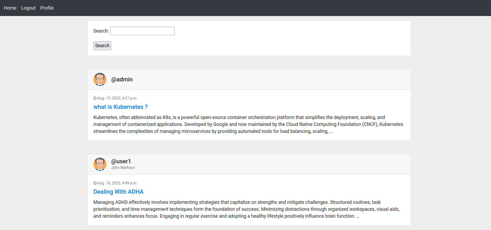
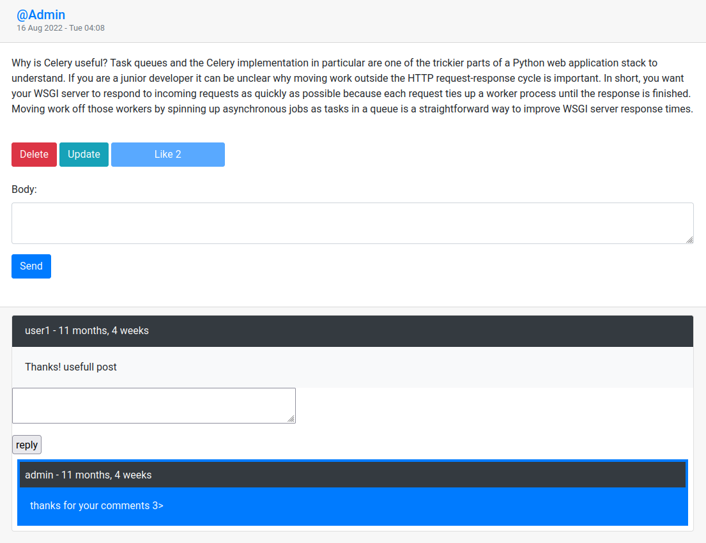
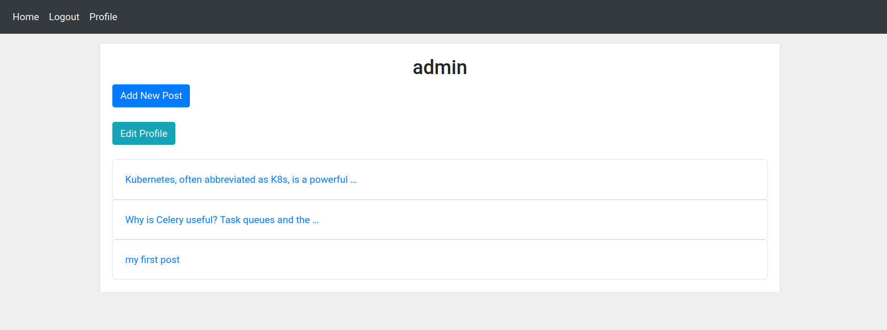
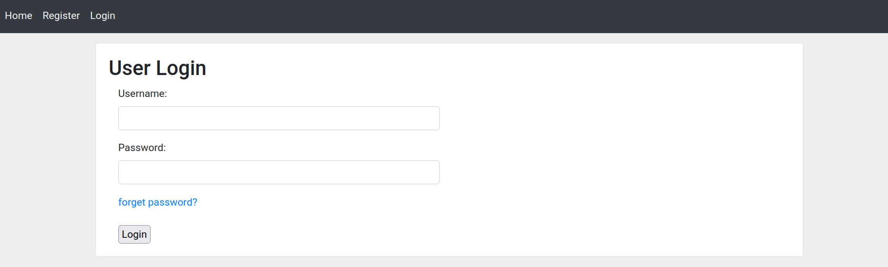
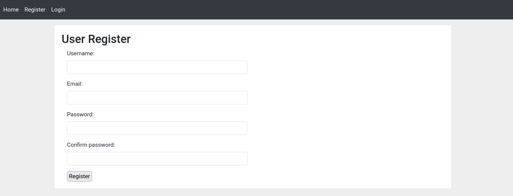

<p align="center">
  <br/>

  
  
  
  <br/>
  
  <br/>
</p>

# About Pwitter

Hey folks! Welcome to **"Pwitter"**  a super cool open-source full-stack web app I cooked up using
Django. If you're into social media (who isn't, right?), imagine a Twitter-like playground where you can share your
thoughts, connect with awesome people, and just have a blast. This project is not just about code; it's about showing
off some skills, learning together, and building something that brings people closer.

# Features

- [x] Based on **Django 4**
- [x] **login** / **logout**, **register** and forget password
- [x] custom authentication methods
- [x] User can **create**, **edit** and **delete** own posts
- [x] **Follow** / **Unfollow** other users
- [x] **like** posts
- [x] **comment** and **reply** on posts
- [x] personal **profile** for each user
- [x] **search** mechanism
- [ ] **Dockerized** project
- [ ] More beautiful looking **User Profile**

# Requirements

```markdown
- python version > 3.9
- django version 4
```

# Run Locally

**Step 1 :** create a new virtualenv and install requirements.

```shell
$ pip install -r requirements.txt
```

**Step 2 :** just create a `static` directory in project root folder

```shell
$ mkdir static
```

**Step 3:** if you want to use **forget password** feature first create `app password` in your google account then put
credential in `settings.py`
```python
EMAIL_HOST_USER = "put your gmail here"
EMAIL_HOST_PASSWORD = "put your super secure password here"
```

**Step 3 :** run django and reach whole project in [http://localhost:8000/](http://localhost:8000/).

```shell
$ python manage.py runserver
```

> you can use `db.sqlite3` DB that is in this project. if you use it, the user and pass for admin test user
> is `admin` and `12345`. enjoy the super secure credential :)

# Screenshots

### Home Page



### Post Details



### Profile



### Login



### Register



# Contribution

checkout the unchecked features. Contributions are very welcome. I appreciate any PR or feedbacks to improve this project.

## You can help this project by Donating
[](https://buymeacoffee.com/promethe) 

# License

Made by ❤️ under [GPLV3](https://choosealicense.com/licenses/agpl-3.0/) license.
